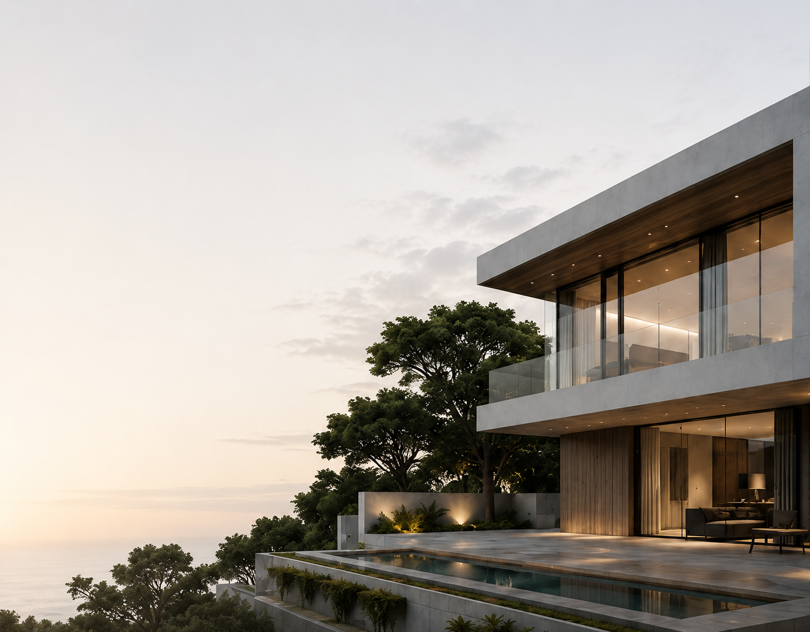
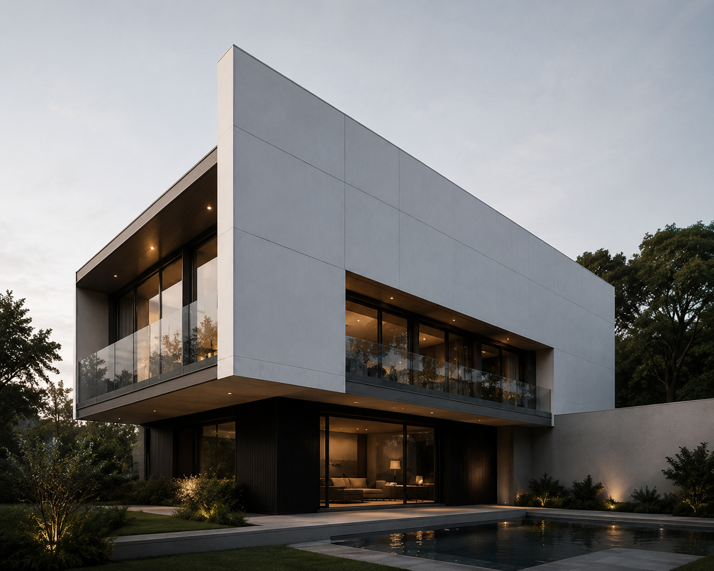
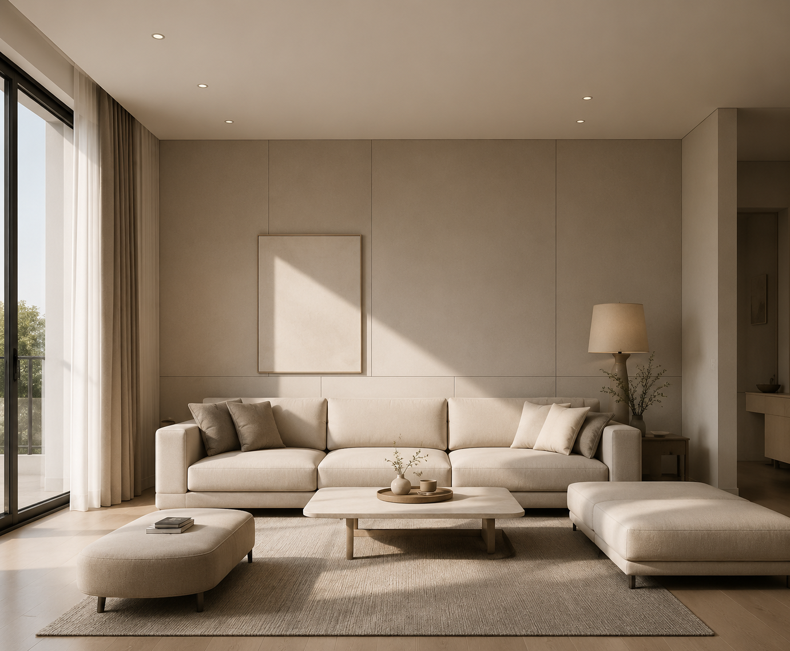
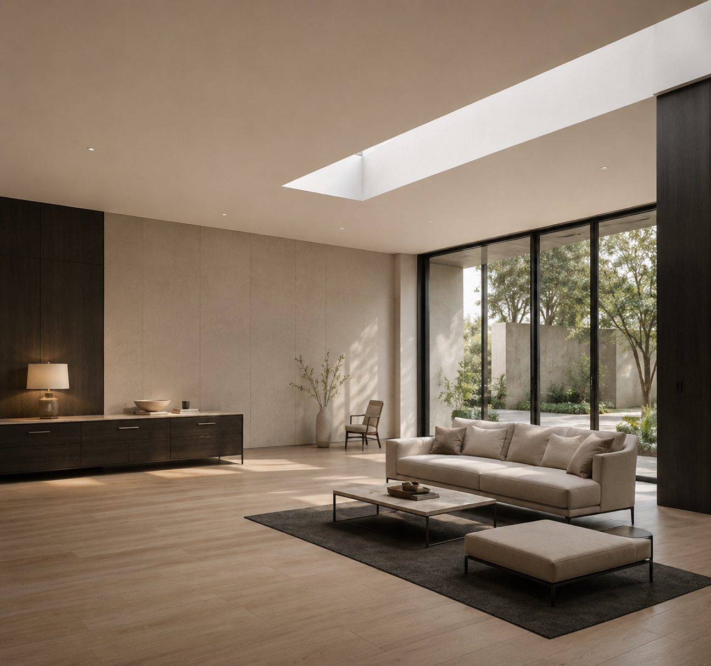
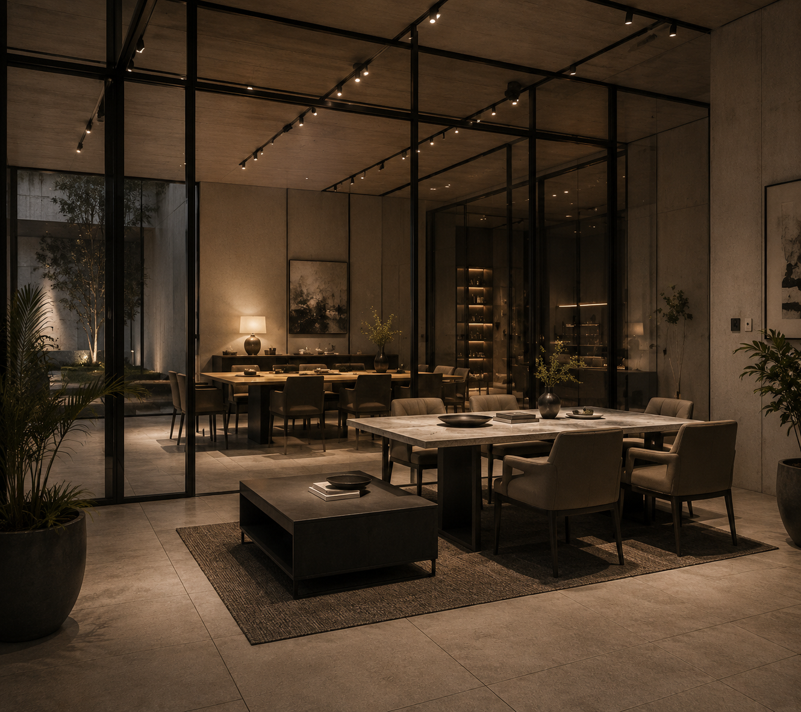

# ATLAS Studio

### Architecture & Interior Design

A fictional multi-page studio website with a **restrained, image-led editorial direction**.

 

---

## ✦ The idea

ATLAS explores how a quiet visual system can carry a full website. The layout uses generous whitespace, architectural imagery and simple typography to keep attention on the work.

## Pages & sections

**Home** — studio introduction, services and selected work

**About** — studio story, approach and visual language

**Projects** — image-led presentation of residential and interior concepts

**Contact** — project enquiry flow and studio details

## Selected visuals

  
  

  
  

## Built with

## Highlights

- Multi-page navigation
- Responsive layouts
- Project gallery and visual sections
- Semantic HTML structure
- Editorial typography and spacing
- Contact / enquiry interface

## Run it

Open `index.html` in a browser. No build step required.

> **Note:** ATLAS Studio is a fictional concept created for this project. The studio details and project content are illustrative.

---

**[← Back to the project collection](../)**

