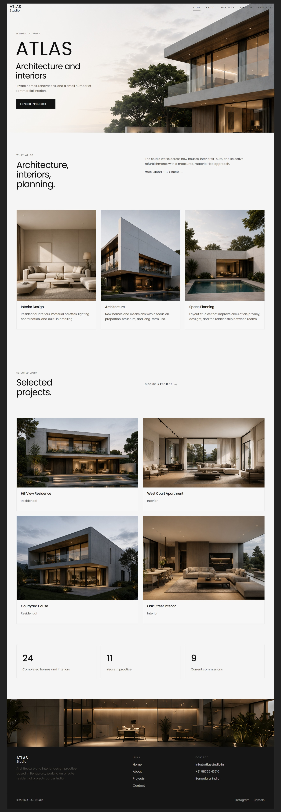
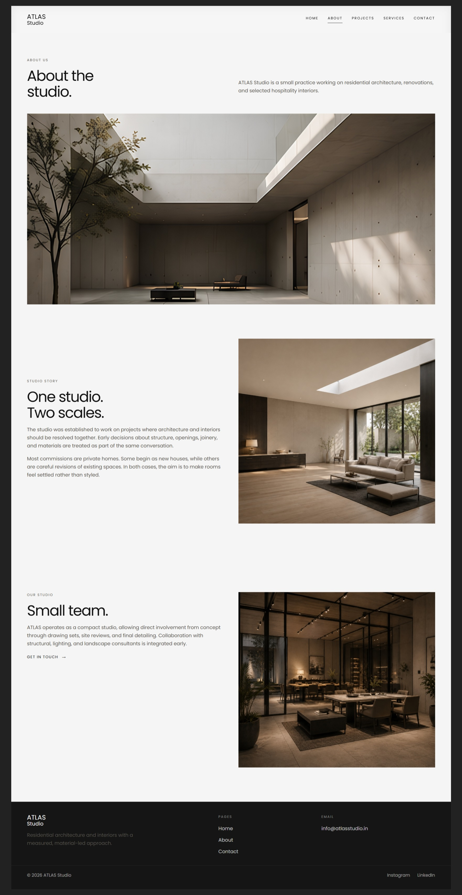
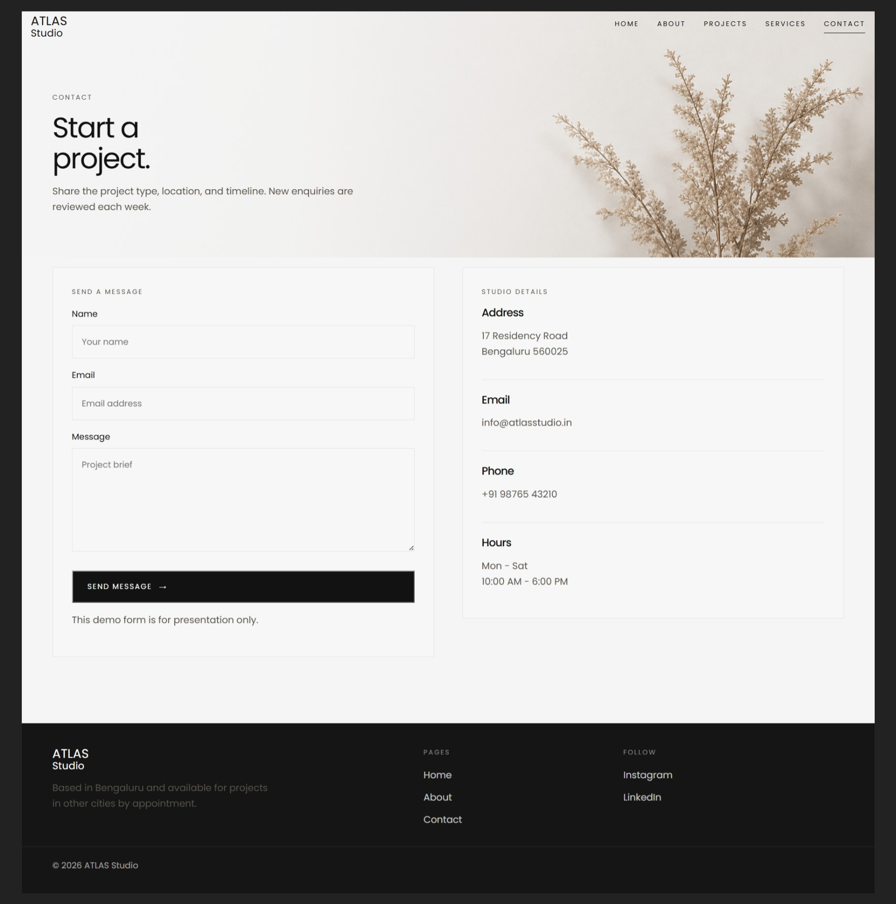

# ✦ Frontend Projects

**interfaces · interaction · visual direction**

A collection of frontend builds where I experiment with layouts, interactions, responsive design, and turning an idea into something you can actually use.

[ AETHER ](#aether) · [ ATLAS STUDIO ](#atlas-studio) · [ CONTACT FORM ](#contact-form)

 

---

## AETHER

### Product Landing Page

A fictional premium sneaker concept with a dark, editorial direction — built around strong typography, product imagery, and a little bit of attitude.

> **Design direction:** dark · editorial · street-luxury

  

  

  

**→ Built with:** HTML · CSS · JavaScript

Responsive navigation, dropdown interactions, product sections, campaign content, CTA interactions, and reveal effects.

[View AETHER →](./Responsive%20Landing%20Page/)

---

## ATLAS Studio

### Architecture & Interior Design — Multi-page Website

A fictional architecture and interiors studio presented through a quiet, image-led visual system. The showcase below uses the actual pages from the project rather than generic mockups.

> **Design direction:** minimal · editorial · image-led

### Home

  

### About

  

### Contact

  

**→ Built with:** HTML · CSS · JavaScript

Multi-page navigation, project presentation, services, responsive layouts, forms, client-side interactions, and semantic markup.

[View ATLAS Studio →](./Multi%20Page%20Website/)

---

## Contact Form

A responsive site focused on form interfaces, validation, and client-side interaction.

  

The project also includes a submissions view for managing saved enquiries locally.

  

**→ Built with:** HTML · CSS · JavaScript

Form UI, validation states, responsive styling, localStorage-based submissions, and supporting pages.

[View Contact Form →](./Contact%20Form/)

---

## ✦ What I like exploring

**Visual design**  ·  **Responsive layouts**  ·  **Interaction**  ·  **Frontend fundamentals**

These are practice builds, not client projects. Each one started as a way to try something different — a visual style, a layout idea, or an interaction pattern — and turn it into a working website.

### Stack

  

**HTML5 · CSS3 · JavaScript · Responsive Web Design**

---

*The brands and content used in these projects are fictional concepts.*

