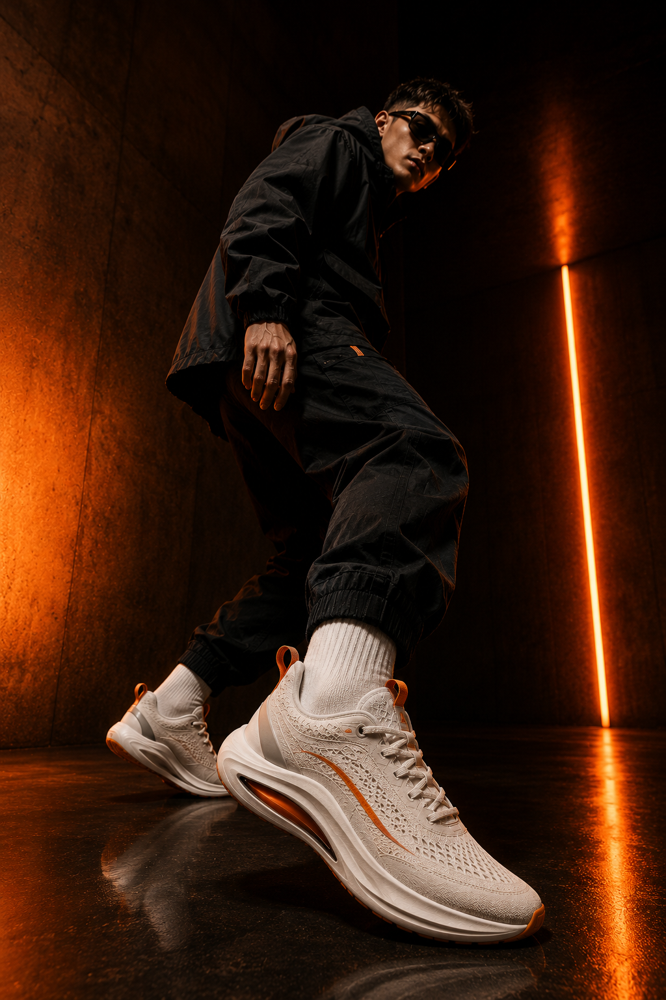
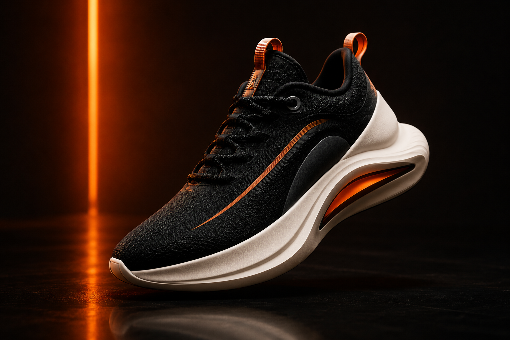
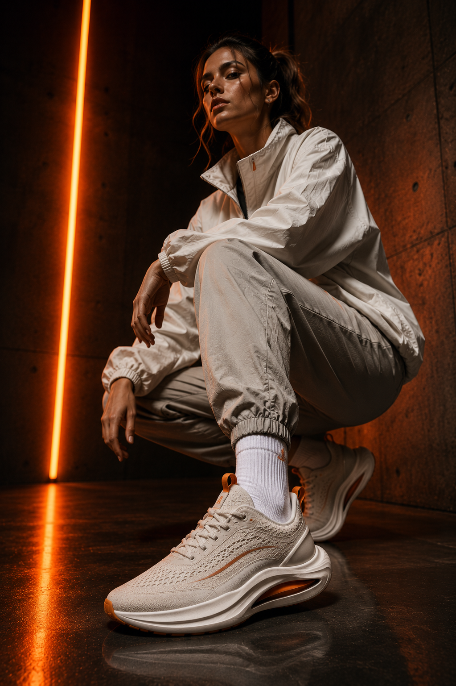

# AETHER

### Move Different.

A fictional premium sneaker landing page built around **editorial visuals, bold typography and interactive UI**.

 

---

## ✦ The idea

AETHER was built as a visual-first landing page rather than a conventional product grid. The goal was to experiment with **contrast, typography, product presentation and motion** while keeping the experience responsive.

## What is inside

- Responsive navigation and dropdown interactions
- Product showcase for multiple sneaker silhouettes
- Editorial campaign section
- CTA and launch interactions
- Responsive layouts across screen sizes
- Subtle reveal / hover effects

## Visual direction

Dark surfaces · warm accent tones · oversized type · cinematic product imagery

  
  

## Built with

  

## Run it

Open `index.html` in a browser. No build step required.

> **Note:** AETHER is a fictional brand/concept created for this project.

---

**[← Back to the project collection](../)**

